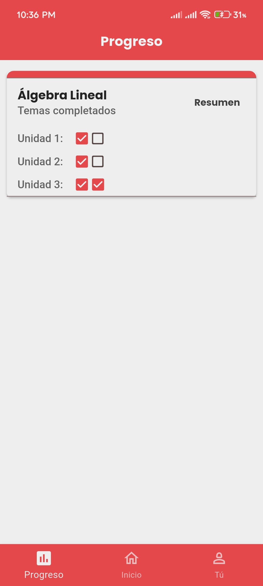
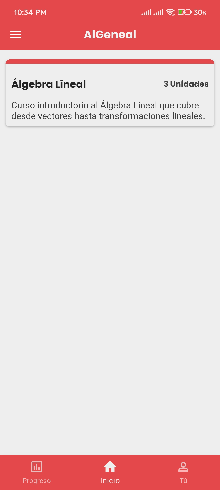
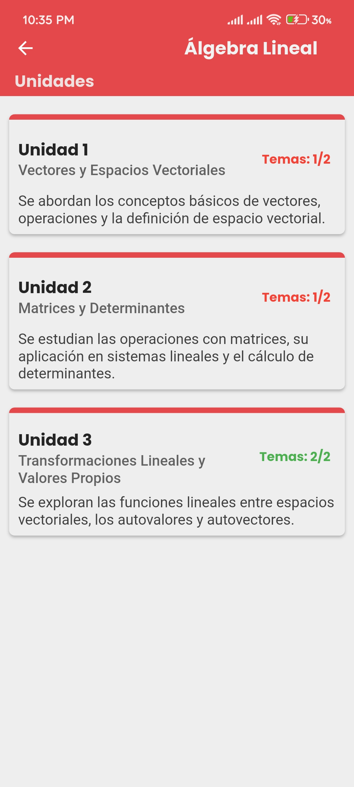
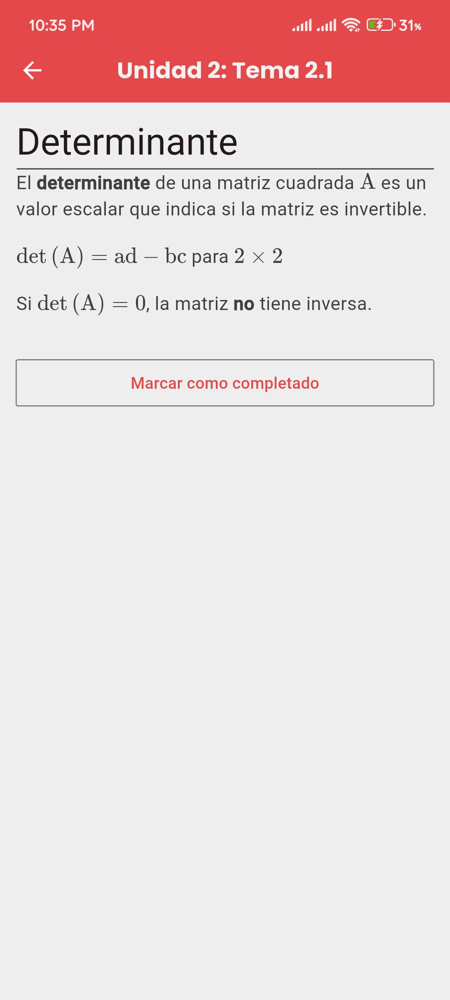
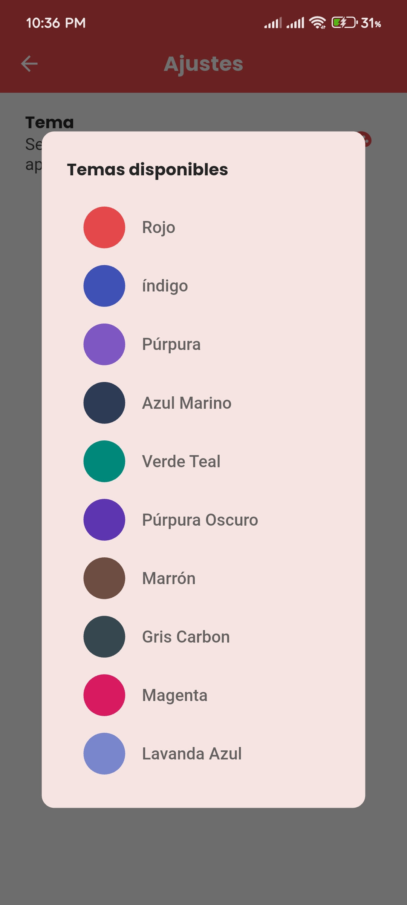
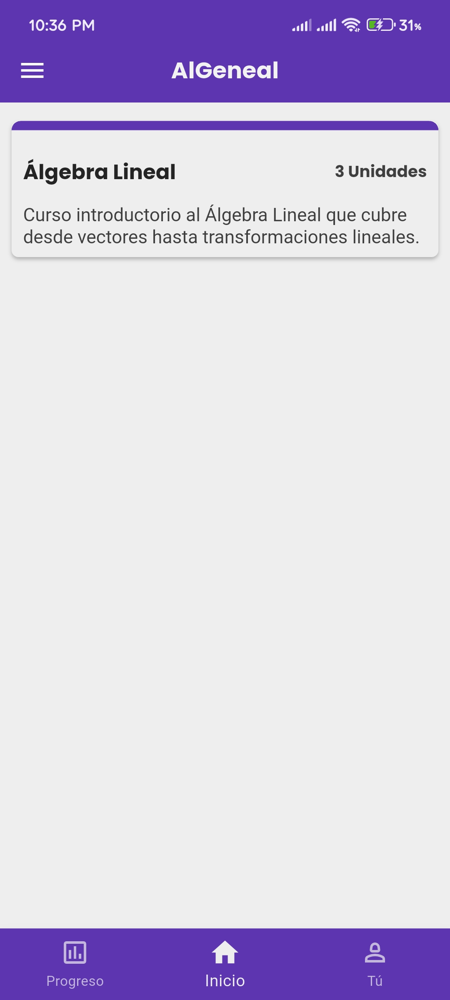
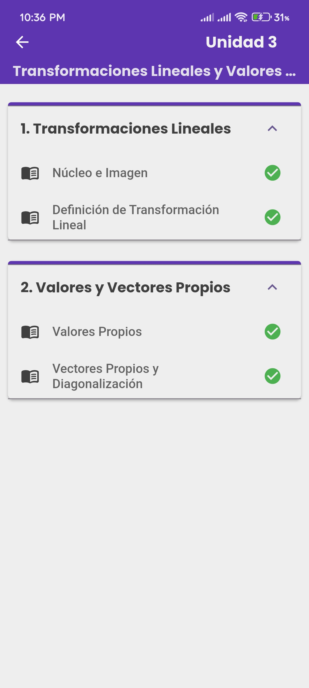
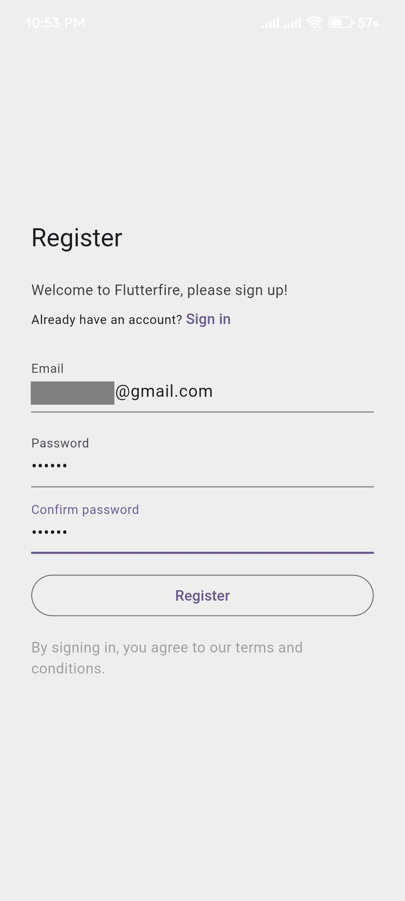
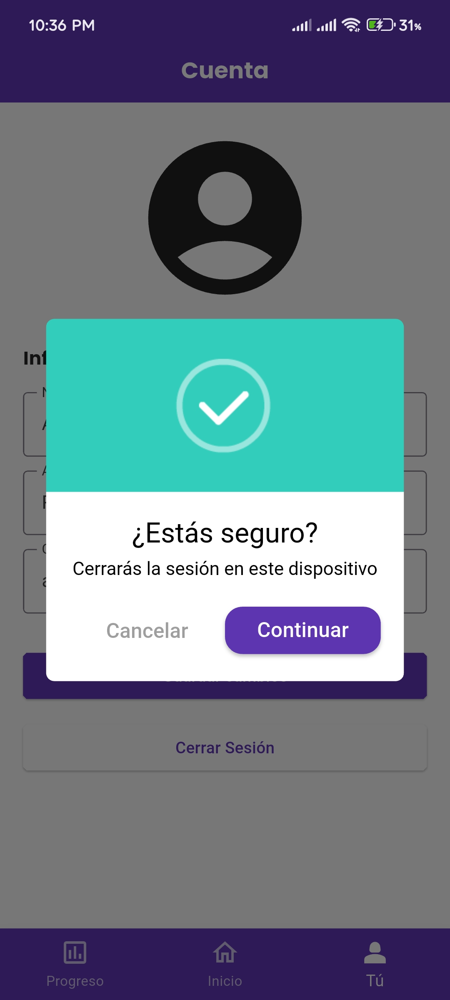

# AlGeneal :books:

AlGeneal es una aplicación educativa multiplataforma (Android y Web como alternativa a iOS) desarrollada en **Flutter**, orientada a apoyar el **aprendizaje autónomo de Álgebra Lineal.**
La aplicación permite a los estudiantes estudiar contenido estructurado, dar seguimiento a su progreso y mantener su información sincronizada en la nube mediante **Firebase.**

El objetivo principal de AlGeneal es **organizar el estudio, visualizar el avance y mejorar la experiencia de aprendizaje** en una materia que suele resultar abstracta para muchos estudiantes.

---

## Tecnologías :rocket:

### Flutter
Flutter es un SDK de código abierto desarrollado por Google que permite crear aplicaciones multiplataforma a partir de un único código en Dart.
Se utilizó por su:
- Alto rendimiento
- Desarrollo rápido de interfaces
- Facilidad para mantener una sola base de código para móvil y web

### Firebase (Backend as a Service)
Firebase se empleó como backend debido a su integración nativa con Flutter y su enfoque en aplicaciones modernas.
Servicios utilizados:
- **Authentication:** Registro e inicio de sesión mediante correo electrónico
- **Cloud Firestore:** Almacenamiento de datos en una base NoSQL con sincronización en tiempo real
- **App Hosting:** Despliegue de la versión web de la aplicación

---

## Características Principales :pushpin:

1. **Autenticación y usuarios:**
    - Registro e inicio de sesión con correo y contraseña
    - Perfil de usuario con nombre y apellidos
    - Persistencia de sesión
2. **Contenido académico:**
    - Contenido organizado jerárquicamente por:
        - Curso
        - Unidad
        - Tema
        - Subtema
    - Teoría presentada en **formato Markdown,** lo que permite una lectura clara y estilizada
    - Acceso al contenido sin conexión con sincronización diferida
3. **Seguimiento del progreso:**
    - Marcar subtemas como vistos o completados
    - Visualización del avance por unidad
    - Sincronización automática del progreso con la nube
4. **Interfaz y experiencia de usuario:**
    - Diseño ligero e intuitivo
    - Uso de tarjetas con títulos claros y descripciones breves
    - Indicadores visuales de progreso
    - Animaciones y retroalimentación visual
    - Diseño responsivo para celular en la versión web
5. **Personalización:**
    - Selección entre 10 temas visuales
    - Manejo global del tema mediante Provider
6. **Multiplataforma:**
    - Versión móvil para Android
    - Aplicación web como alternativa para iOS

---

## Estado del Proyecto
:green_circle: **Versión funcional**

La aplicación se encuentra en una versión estable (2.1.0) donde todas las funcionalidades principales están implementadas y operativas.

:wrench: **En desarrollo**

- Exámenes parciales
- Ejercicios prácticos por subtema
- Estadísticas de desempeño
- Mejora de la retroalimentación visual

---

## Arquitectura y decisiones técnicas :file_folder:

- **Manejo de estado:** Provider para el control global del usuario, progreso y tema visual

- **Firestore como fuente única de verdad:** El progreso del usuario se sincroniza automáticamente entre dispositivos

- **Soporte offline:** El contenido puede consultarse sin conexión y se sincroniza cuando el usuario recupera conectividad

- **Separación de responsabilidades:** Uso de modelos, providers y screens para mantener el código organizado y escalable

---

## Capturas :iphone:

### Pantallas Principales
Barra de navegación inferior entre pantallas.

### Contenido
Organización del contenido en cursos, unidades y temas, presentados como tarjetas con indicadores de progreso.

Los subtemas se muestran en formato Markdown para facilitar la lectura y el estilo del contenido.

### Retroalimentación
Animaciones breves que informan al usuario sobre acciones importantes dentro de la aplicación:
- Primera imagen: Notificación al completar un subtema
- Segunda imagen: Pantallas de carga durante la sincronización y carga de contenido

### Personalización
Selección del color principal de la aplicación.

### Autenticación
Registro de cuentas, inicio de sesión y cierre de sesión.

